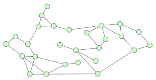
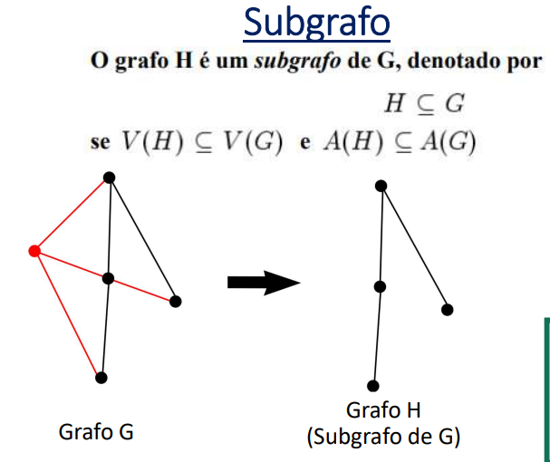
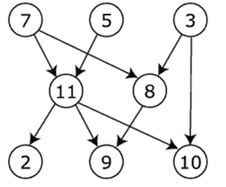
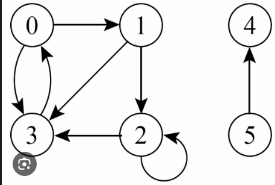
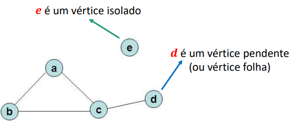
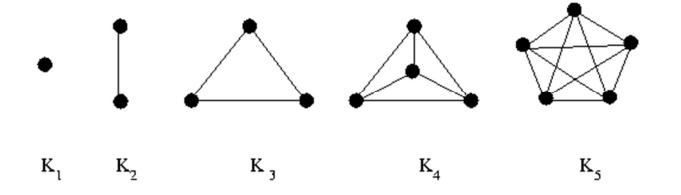
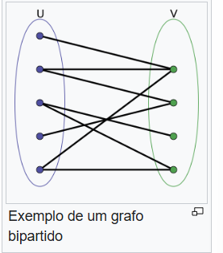

# Teoria dos Grafos

## Você consegue fazer o seguinte desenho sem tirar o lápis do papel?
- É uma dinâmica que envolve grafos. 

## Conceito:
- Leonhard Euler; 
- Um grafo é um conjunto de vértices (Pontos ou nós) e arestas(traços ou arcos), em que cada aresta conecta dois vértices.
- Um grafo é um par de conjuntos G = (V,A), em V é o conjutos de vértices e A é o conjunto de arestas. 
- V = {X,Y,Z, ...}
- A = {(X,Y); (Y,Z); ...}
## Adjacentes: 
- Quando existe uma aresta ligando dois vértices dizemos que os vértices são adjacentes, e que a aresta é incidente aos vértices. 

## Quantidade:
- |V|: Número de vértices.
- |A|: Número de arestas.

## Grau de um vértice:
- O número de vezes que as arestas incidem sobre o vértice v é chamado de grau de vértice v, sembolizado por d(v).
- Arestas que tocam e conectam esse ponto com outros.

## Sub-Grafo Induzido:
- Um subgrafo induzido é um subgrafo de um grafo G que é obtido a partir da remoção de vértices de G. 
- Um subgrafo H é induzido de G quando todas as arestas de G que têm ambos os extremos em H também estão em H. 

- Para representar um subgrafo induzido, usa-se a notação G[VH], onde VH é o conjunto de vértices do subgrafo. 

- Por exemplo, se G = ({a, b, c, d, e}, {(a, b), (b, c), (b, d), (d, e), (c, d)}), então H1 = ({a, b, c}, {(a,b), (b, c)}) é um subgrafo induzido de G.

- Um teorema da teoria dos grafos diz que todo grafo é um subgrafo induzido dele mesmo.

## Sub-Grafo Abragente:
- Um grafo abrangente se refere a um subgrafo de um grafo original que inclui todos os vértices e um conjunto de arestas selecionado para garantir a conectividade, sem ciclos, entre esses vértices. Esse tipo de grafo também é conhecido como árvore abrangente (ou "árvore geradora").

## Grafo Direcionado:
- Um grafo direcionado é um grafo em que cada aresta tem uma orientação.
- G = (V,A):

- V = {2,3,5,7,8,9,10,11}
- A = {(3,8); (3,10), (5, 11), (7,8), (7,11), (8,9), (11,2); (11,9), (11,10)}

## Laço ou Loop:
- É uma aresta que liga um vértice a ele mesmo.

## Multigrafo (ou Grafo com Multi-arestas)
- Múltiplas arestas entre os mesmos vértices:
- Diferentemente de um grafo simples, onde há no máximo uma aresta entre dois vértices, no multigrafo podemos ter várias arestas conectando o mesmo par de vértices. Essas arestas podem representar diferentes relações ou caminhos entre os vértices.

- Auto-laços opcionais: Em alguns casos, os multigrafos também permitem auto-laços (uma aresta que conecta um vértice a ele mesmo), mas isso depende do contexto.

## Multigrafo Orientado
- Dois vértices podem estar ligados por mais de uma aresta, nesse caso dizemos que estas são arestas paralelas (ou arestas múltiplas).

## Grafo Simples
- Grafos sem laços ou arestas múltiplas (ou paralelas) são chamados de grafos simples.

- A ordem de um Grafo é a quantidade de vértices que ele
possui.

## Sobre os Graus dos Vértices de um Grafo
- Um vérticede grau 0 é dito isolado.
- Um vértice de grau 1 é dito pendente (ou folha).

## Grafo Completo
- Um grafo completo é definido como um grafo onde todo par de vértices é ligado por uma aresta. Um grafo completo com n vértices é denotado por Kn

## Percursos em Grafos
- Em grafos, o conceito de percurso se refere à sequência de vértices e arestas que conectam um vértice a outro.

## 1. Trilha
- **Definição**: Uma trilha é uma sequência de arestas que conecta vértices, onde **não se permite repetir arestas**, mas os vértices podem se repetir.
- Em uma trilha, é possível passar pelo mesmo vértice mais de uma vez, contanto que não se utilize a mesma aresta duas vezes.

## 2. Caminho
- **Definição**: Um caminho é uma trilha **onde nenhum vértice se repete**. Ou seja, nem as arestas nem os vértices podem ser visitados mais de uma vez ao longo do caminho.
- Um caminho é uma sequência de vértices distintos, garantindo que não há ciclos internos.

## 3. Ciclo
- **Definição**: Um ciclo é um percurso que começa e termina no mesmo vértice, **sem repetir arestas ou vértices ao longo do percurso** (exceto o vértice inicial/final, que se repete apenas uma vez).
- Para que um ciclo exista, o grafo deve ser conexo, e o percurso deve retornar ao vértice de partida após passar por outros vértices sem repeti-los.

## Grafos Conexo 
- Um grafo é conexo se existe um caminho entre qualquer par de vértices, caso contrário ele é chamado desconexo. 
- Dois vértices estão conectados se existe um caminho entre eles no grafo.

## Bipartido
- No campo da matemática da teoria dos grafos, um grafo bipartido ou bigrafo é um grafo cujos vértices podem ser divididos em dois conjuntos disjuntos U e V tais que toda aresta conecta um vértice em U a um vértice em V;[1] ou seja, U e V são conjuntos independentes. Equivalentemente, um grafo bipartido é um grafo que não contém qualquer ciclo de comprimento ímpar.

## Aplicação em Grafos biunívoca
No contexto de grafos, o termo biunívoca aparece geralmente quando falamos de isomorfismo de grafos. Dois grafos são isomorfos quando existe uma correspondência biunívoca entre seus vértices e entre suas arestas, de forma que:

Cada vértice de um grafo está associado a um vértice único no outro grafo.
As conexões (arestas) entre vértices correspondentes também são preservadas.
Em resumo:

Biunívoca implica que existe uma relação um para um e única entre os elementos dos conjuntos (vértices ou arestas) dos dois grafos.

