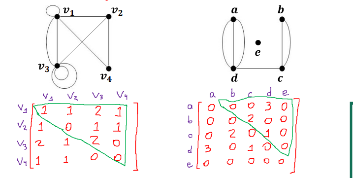
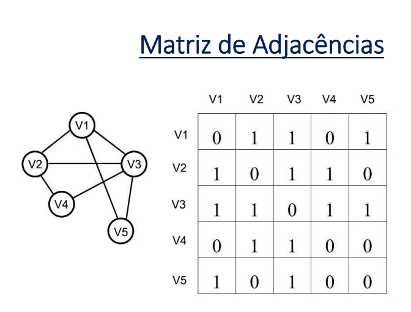

# Matriz de Adjacência em Grafos
- Cada vértice do grafo é representado por uma linha e uma coluna dessa matriz e o elemento aij informa a quantidade de arestas que conecta o vértice da linha i como vértice da coluna j.

- A **matriz de adjacência** é uma forma de representar um grafo em uma estrutura de dados bidimensional (matriz) que indica quais vértices estão conectados por arestas. Essa abordagem é muito útil para verificar rapidamente a presença ou ausência de uma conexão entre dois vértices.

## Estrutura da Matriz de Adjacência
Para um grafo com \( n \) vértices, a matriz de adjacência é uma matriz \( n \times n \) onde:
- Cada linha e coluna representa um vértice do grafo.
- Cada posição \( a_{ij} \) contém:
  - **1** (ou o peso da aresta) se existe uma aresta que conecta o vértice \( i \) ao vértice \( j \);
  - **0** se não há aresta entre \( i \) e \( j \).

- Tipo é as ligações estabelecidas entre os vértices. 

### Características
- Em **grafos não direcionados** (grafo simples), a matriz de adjacência é **simétrica**, ou seja, \( a_{ij} = a_{ji} \).
- Em **grafos direcionados**, a matriz pode ser assimétrica, pois a conexão de \( i \) para \( j \) não implica uma conexão de \( j \) para \( i \).

## Exemplo 1: Grafo Não Direcionado
Consideremos um grafo não direcionado com os vértices \( A, B, C, D \) e as seguintes arestas:
- \( A - B \)
- \( A - C \)
- \( B - D \)
  
Esse grafo possui 4 vértices e pode ser representado pela matriz de adjacência abaixo:

|     | A | B | C | D |
|-----|---|---|---|---|
| **A** | 0 | 1 | 1 | 0 |
| **B** | 1 | 0 | 0 | 1 |
| **C** | 1 | 0 | 0 | 0 |
| **D** | 0 | 1 | 0 | 0 |

- A célula \( a_{AB} \) e \( a_{BA} \) contém 1, indicando que há uma conexão entre \( A \) e \( B \).
- A célula \( a_{AD} \) contém 0, indicando que não há conexão direta entre \( A \) e \( D \).

## Exemplo 2: Grafo Direcionado
Agora, considere um grafo direcionado com os vértices \( A, B, C, D \) e as seguintes arestas direcionadas:
- \( A \rightarrow B \)
- \( A \rightarrow C \)
- \( B \rightarrow D \)
  
A matriz de adjacência para esse grafo direcionado seria:

|     | A | B | C | D |
|-----|---|---|---|---|
| **A** | 0 | 1 | 1 | 0 |
| **B** | 0 | 0 | 0 | 1 |
| **C** | 0 | 0 | 0 | 0 |
| **D** | 0 | 0 | 0 | 0 |

- A célula \( a_{AB} \) contém 1, mas \( a_{BA} \) contém 0, indicando que a aresta existe de \( A \) para \( B \), mas não de \( B \) para \( A \).

## Vantagens e Desvantagens da Matriz de Adjacência
### Vantagens
- Permite **acesso rápido** para verificar a existência de uma aresta entre dois vértices.
- Útil para grafos densos (com muitas arestas), pois não desperdiça muito espaço.

