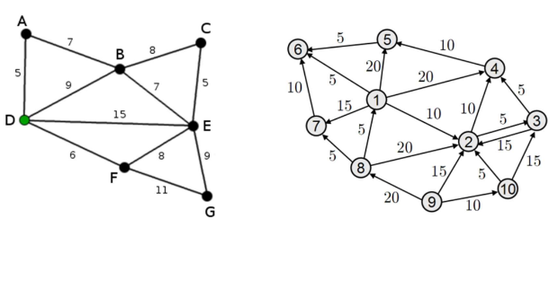
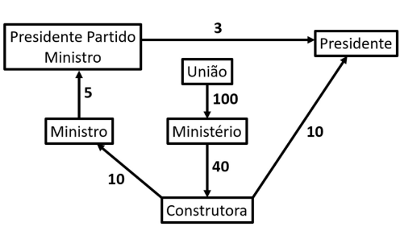

# Grafo Valorado
- Um grafo é valorado (ou ponderado) quando suas arestas possuem um peso, isto é, quando é atribuído um valor para cada aresta do grafo, esse valor pode indicar distâncias, tempos, custos ou qualquer coisa referente à aplicação.

# Grafo complementar
- Em teoria dos grafos, o complemento ou inverso de um grafo G é um grafo H nos mesmos vértices tais que dois vértices de H são adjacentes se e somente se eles não são adjacentes em G. Isso é para encontrar o complemento de um grafo, você preenche todas as arestas que faltavam para obter um grafo completo, e remove todas as arestas que já estavam lá. Não é o conjunto complementar do grafo; apenas as arestas são complementadas.

# Grafo Euleriano:
- Um grafo será Euleriano se existe uma trilha fechada (não repete arestas / começa e termina no mesmo vértice) que passa por todas as arestas de G.

- Teorema de Euler (1736): Um grafo conexo é Euleriano se, e somente
se, todos seus vértices tem grau par.

- A trilha que passa por todas as arestas começa e
termina no mesmo vértice.

# Grafo conectado
- Em teoria dos grafos, um grafo conectado é um grafo em que existe um caminho entre qualquer par de vértices. Isso significa que para qualquer dois vértices u e v no grafo, você pode ir de u a 𝑣 seguindo as arestas do grafo, sem precisar sair dele ou pular vértices.

# Caminho hamiltoniano
- Um caminho hamiltoniano é um caminho que permite passar por todos os vértices de um grafo G, não repetindo nenhum, ou seja, passar por todos uma e uma só vez por cada. Caso esse caminho seja possível descrever um ciclo, este é denominado ciclo hamiltoniano (ou circuito hamiltoniano) em G.